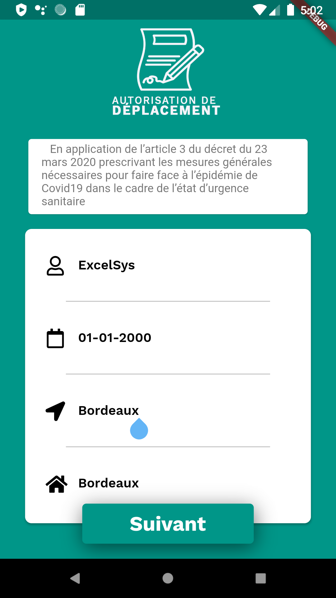
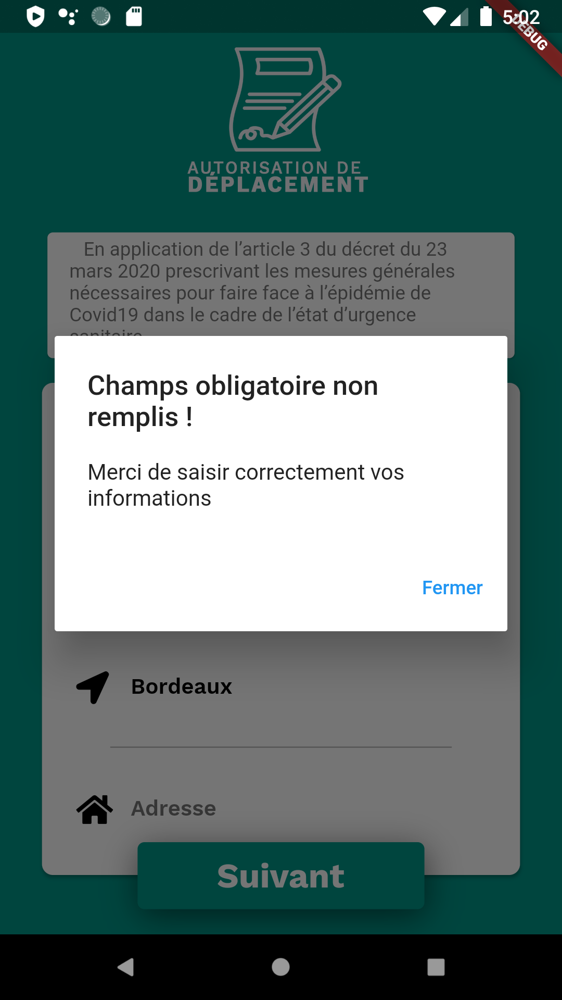
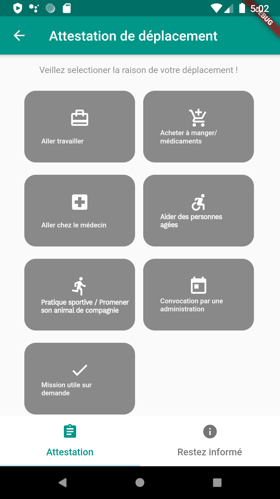
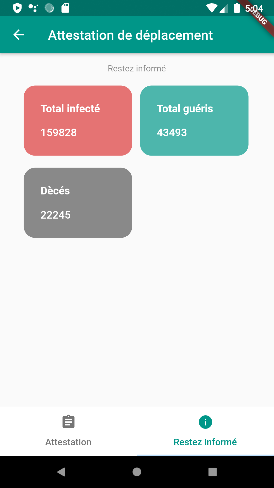

# derogatory-travel-certificate
> attestation-de-deplacement-d-rogatoire

app to generate the derogatory travel certificate and get updates from trusted resources about the situation of covid19.[The Virus Tracker API](https://thevirustracker.com/api) was used to provide the data.

> Une application pour générer l'attestation de déplacement dérogatoire et obtenir des mises à jour de ressources fiables sur la situation de covid19 en France [l'API thevirus tracker] (https://thevirustracker.com/api) a été utilisée pour fournir les données.

## Requirements

```
* Any Operating System (i.e MacOS X, Linux, Windows)
* Any IDE with Flutter SDK installed (ie. IntelliJ, Android Studio, VSCode etc)
* A little knowledge of Dart and Flutter
```

## Features
- [x] See cases statistics in France.
- [x] Generate the derogatory travel certificate (France templete).

> - [x] Les statistiques de covid19 en France.
> - [x] générer l'attestation de déplacement dérogatoire en Qr code.

## Screenshots
<div style="background-color:rgb(169,169,169); text-align:center">

&nbsp;

</div>


<div style="background-color:rgb(169,169,169); text-align:center">

&nbsp;

</div>


<div style="background-color:rgb(169,169,169); text-align:center">

&nbsp;

</div>

